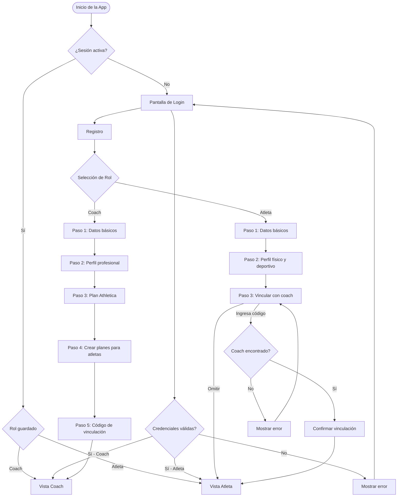
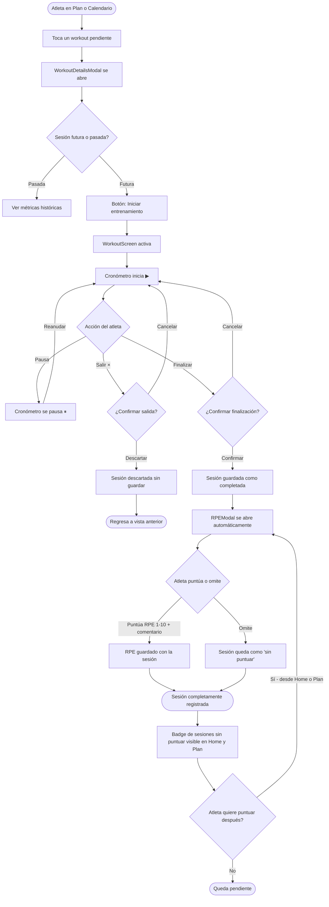
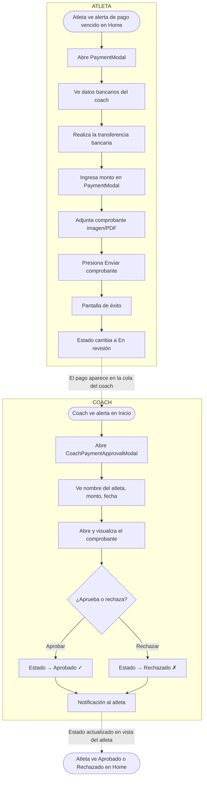
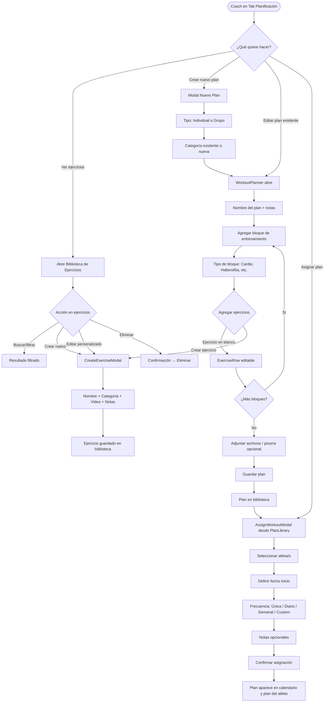
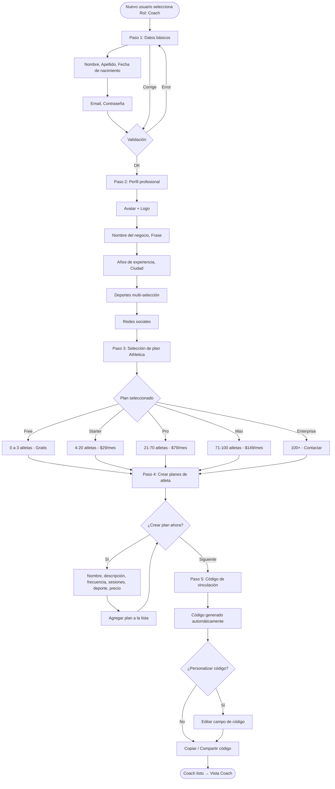
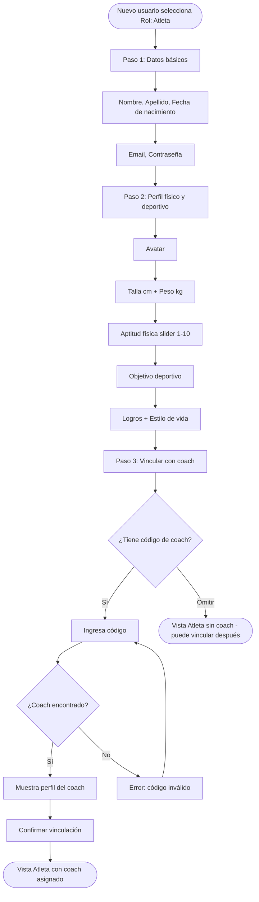
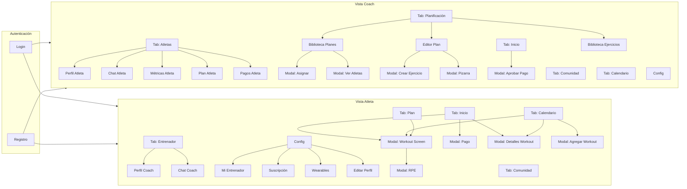
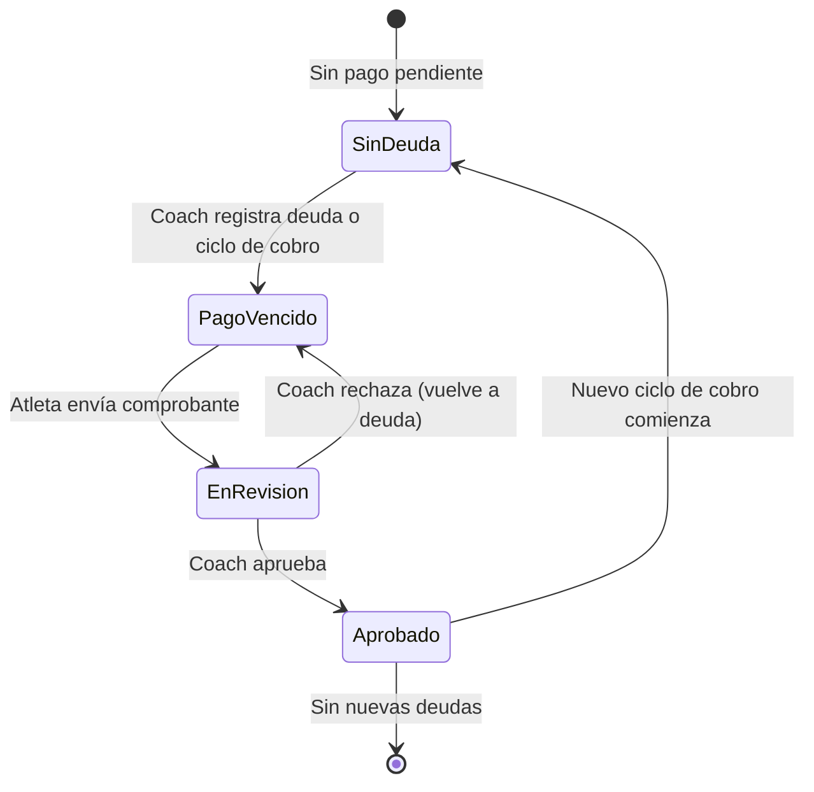
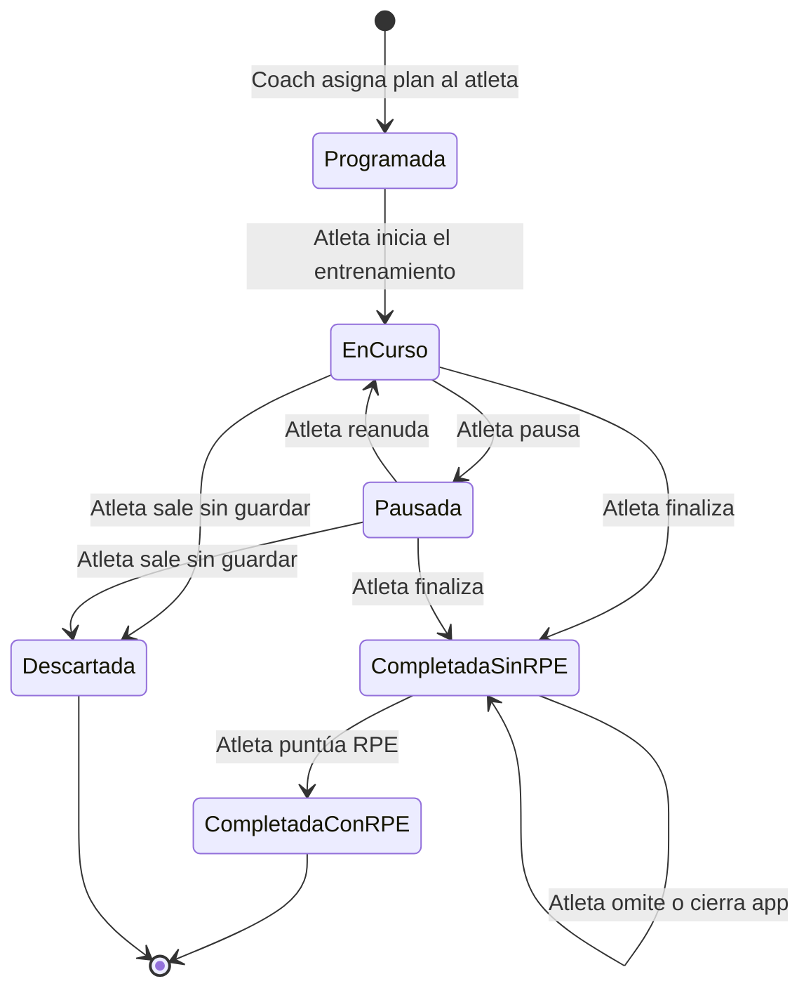
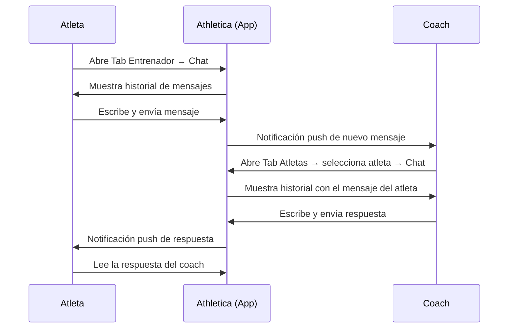

# Athletica — Diagramas de Flujo

> Los diagramas están escritos en sintaxis **Mermaid**. Se visualizan automáticamente en GitHub, GitLab, Notion, Obsidian y la mayoría de editores de documentación modernos.

---

## Flujo 1 — Autenticación y Registro

---

## Flujo 2 — Ejecución de Entrenamiento (Atleta)

---

## Flujo 3 — Gestión de Pagos

---

## Flujo 4 — Planificación y Asignación de Entrenamientos (Coach)

---

## Flujo 5 — Registro de Coach (Onboarding completo)

---

## Flujo 6 — Registro de Atleta (Onboarding completo)

---

## Flujo 7 — Navegación General (Mapa de Interacciones)

---

## Flujo 8 — Estados del Pago (Diagrama de Estado)

---

## Flujo 9 — Estados de una Sesión de Entrenamiento

---

## Flujo 10 — Comunicación Coach–Atleta

