# Athletica — Diagrama Entidad-Relación (ERD)

> El diagrama está en sintaxis **Mermaid (erDiagram)**. Se visualiza automáticamente en GitHub, GitLab, Notion, Obsidian, etc.

---

## Diagrama Principal

```mermaid
erDiagram

    USUARIO {
        uuid id PK
        string email
        string password_hash
        string nombre
        string apellido
        date fecha_nacimiento
        string avatar_url
        enum rol "coach | atleta"
        timestamp created_at
        timestamp updated_at
        boolean activo
    }

    COACH {
        uuid id PK
        uuid usuario_id FK
        string nombre_negocio
        string frase
        string logo_url
        int anios_experiencia
        string ciudad
        string instagram_url
        string strava_url
        string codigo_vinculacion
        uuid plan_athletica_id FK
        timestamp created_at
    }

    ATLETA {
        uuid id PK
        uuid usuario_id FK
        uuid coach_id FK
        float talla_cm
        float peso_kg
        int aptitud_fisica
        string objetivo
        string logros
        string estilo_vida
        timestamp vinculado_en
    }

    PLAN_ATHLETICA {
        uuid id PK
        string nombre
        string descripcion
        int max_atletas
        decimal precio_mensual
        boolean es_enterprise
    }

    SUSCRIPCION_COACH {
        uuid id PK
        uuid coach_id FK
        uuid plan_athletica_id FK
        enum estado "activa | cancelada | vencida"
        date fecha_inicio
        date fecha_renovacion
        decimal monto_pagado
    }

    DEPORTE {
        uuid id PK
        string nombre
    }

    COACH_DEPORTE {
        uuid coach_id FK
        uuid deporte_id FK
    }

    PLAN_ENTRENAMIENTO {
        uuid id PK
        uuid coach_id FK
        string nombre
        text notas
        enum tipo "individual | grupal"
        string categoria
        timestamp created_at
        timestamp updated_at
    }

    BLOQUE_ENTRENAMIENTO {
        uuid id PK
        uuid plan_id FK
        string nombre
        enum tipo "Cardio | Halterofilia | Flexibilidad | Deporte_Especifico | Recuperacion | Otro | custom"
        text comentarios
        int orden
    }

    EJERCICIO_TEMPLATE {
        uuid id PK
        uuid coach_id FK
        string nombre
        string categoria
        string video_url
        text notas
        boolean es_predeterminado
        timestamp created_at
    }

    EJERCICIO_EN_BLOQUE {
        uuid id PK
        uuid bloque_id FK
        uuid ejercicio_template_id FK
        string nombre_custom
        string series
        string repeticiones
        string duracion
        string intensidad
        text notas
        int orden
    }

    ARCHIVO_ADJUNTO {
        uuid id PK
        uuid plan_id FK
        string nombre
        string url
        enum tipo "file | drawing"
        string mime_type
        timestamp created_at
    }

    ASIGNACION {
        uuid id PK
        uuid plan_id FK
        uuid coach_id FK
        date fecha_inicio
        enum frecuencia "once | daily | weekly | custom"
        json dias_custom
        text notas
        timestamp created_at
    }

    ASIGNACION_ATLETA {
        uuid asignacion_id FK
        uuid atleta_id FK
    }

    SESION {
        uuid id PK
        uuid atleta_id FK
        uuid asignacion_id FK
        string nombre
        string categoria
        json etapas
        timestamp inicio
        timestamp fin
        int duracion_seg
        int calorias
        float fc_promedio
        float fc_maxima
        float distancia_km
        float ritmo_min_km
        enum estado "programada | en_curso | completada | descartada"
        timestamp created_at
    }

    RPE {
        uuid id PK
        uuid sesion_id FK
        int valor
        text comentario
        timestamp created_at
    }

    PLAN_COACH_ATLETA {
        uuid id PK
        uuid coach_id FK
        string nombre
        text descripcion
        enum frecuencia "semanal | mensual"
        int sesiones_incluidas
        uuid deporte_id FK
        decimal precio
        boolean activo
        timestamp created_at
    }

    SUSCRIPCION_ATLETA {
        uuid id PK
        uuid atleta_id FK
        uuid plan_coach_atleta_id FK
        enum estado "activa | cancelada | vencida"
        date fecha_inicio
        date fecha_renovacion
    }

    PAGO {
        uuid id PK
        uuid atleta_id FK
        uuid coach_id FK
        uuid suscripcion_atleta_id FK
        decimal monto
        string comprobante_url
        string comprobante_nombre
        enum estado "pendiente | aprobado | rechazado"
        timestamp enviado_en
        timestamp revisado_en
        text nota_rechazo
    }

    PUBLICACION {
        uuid id PK
        uuid coach_id FK
        text contenido
        string imagen_url
        timestamp created_at
        timestamp updated_at
    }

    REACCION_PUBLICACION {
        uuid id PK
        uuid publicacion_id FK
        uuid usuario_id FK
        enum tipo "like"
        timestamp created_at
    }

    COMENTARIO_PUBLICACION {
        uuid id PK
        uuid publicacion_id FK
        uuid usuario_id FK
        text contenido
        timestamp created_at
    }

    MENSAJE {
        uuid id PK
        uuid remitente_id FK
        uuid destinatario_id FK
        text contenido
        string adjunto_url
        boolean leido
        timestamp created_at
    }

    NOTIFICACION {
        uuid id PK
        uuid usuario_id FK
        enum tipo "nuevo_mensaje | pago_recibido | pago_aprobado | pago_rechazado | workout_asignado | sesion_proxima"
        string titulo
        string cuerpo
        json data
        boolean leida
        timestamp created_at
    }

    WEARABLE_CONEXION {
        uuid id PK
        uuid atleta_id FK
        enum dispositivo "apple_watch | garmin | polar | suunto | fitbit | apple_health | strava | google_fit"
        string token_acceso
        boolean activo
        timestamp conectado_en
    }

    CATEGORIA_EJERCICIO {
        uuid id PK
        uuid coach_id FK
        string nombre
        boolean es_predeterminada
    }

    CATEGORIA_PLAN {
        uuid id PK
        uuid coach_id FK
        string nombre
        boolean es_predeterminada
    }

    %% Relaciones

    USUARIO ||--o| COACH : "es"
    USUARIO ||--o| ATLETA : "es"
    COACH ||--o{ ATLETA : "entrena"
    COACH }o--|| PLAN_ATHLETICA : "suscrito a"
    COACH ||--o{ SUSCRIPCION_COACH : "tiene"
    SUSCRIPCION_COACH }o--|| PLAN_ATHLETICA : "corresponde a"

    COACH ||--o{ COACH_DEPORTE : "practica"
    DEPORTE ||--o{ COACH_DEPORTE : "practicado por"

    COACH ||--o{ PLAN_ENTRENAMIENTO : "crea"
    PLAN_ENTRENAMIENTO ||--o{ BLOQUE_ENTRENAMIENTO : "contiene"
    BLOQUE_ENTRENAMIENTO ||--o{ EJERCICIO_EN_BLOQUE : "tiene"
    EJERCICIO_EN_BLOQUE }o--o| EJERCICIO_TEMPLATE : "basado en"
    COACH ||--o{ EJERCICIO_TEMPLATE : "crea"
    PLAN_ENTRENAMIENTO ||--o{ ARCHIVO_ADJUNTO : "incluye"

    PLAN_ENTRENAMIENTO ||--o{ ASIGNACION : "asignado en"
    ASIGNACION ||--o{ ASIGNACION_ATLETA : "incluye"
    ATLETA ||--o{ ASIGNACION_ATLETA : "asignado a"

    ATLETA ||--o{ SESION : "realiza"
    ASIGNACION ||--o{ SESION : "genera"
    SESION ||--o| RPE : "tiene"

    COACH ||--o{ PLAN_COACH_ATLETA : "ofrece"
    PLAN_COACH_ATLETA }o--|| DEPORTE : "de deporte"
    ATLETA ||--o{ SUSCRIPCION_ATLETA : "tiene"
    SUSCRIPCION_ATLETA }o--|| PLAN_COACH_ATLETA : "corresponde a"

    ATLETA ||--o{ PAGO : "realiza"
    COACH ||--o{ PAGO : "recibe"
    SUSCRIPCION_ATLETA ||--o{ PAGO : "asociado a"

    COACH ||--o{ PUBLICACION : "publica"
    PUBLICACION ||--o{ REACCION_PUBLICACION : "recibe"
    PUBLICACION ||--o{ COMENTARIO_PUBLICACION : "recibe"
    USUARIO ||--o{ REACCION_PUBLICACION : "hace"
    USUARIO ||--o{ COMENTARIO_PUBLICACION : "hace"

    USUARIO ||--o{ MENSAJE : "envía"
    USUARIO ||--o{ MENSAJE : "recibe"
    USUARIO ||--o{ NOTIFICACION : "recibe"

    ATLETA ||--o{ WEARABLE_CONEXION : "conecta"

    COACH ||--o{ CATEGORIA_EJERCICIO : "gestiona"
    COACH ||--o{ CATEGORIA_PLAN : "gestiona"
```

---

## Descripción de Entidades

### USUARIO
Tabla base común para coaches y atletas. Contiene los datos de autenticación y el rol que determina el tipo de acceso.

| Campo | Descripción |
|-------|-------------|
| `id` | UUID primario |
| `email` | Único, usado para login |
| `password_hash` | Contraseña hasheada (bcrypt) |
| `rol` | `coach` o `atleta` |
| `activo` | Soft delete |

---

### COACH
Extiende USUARIO con la información profesional del entrenador.

| Campo | Descripción |
|-------|-------------|
| `codigo_vinculacion` | Código único que comparte con sus atletas (ej: `CARL-2026-FZQX`) |
| `plan_athletica_id` | Plan de suscripción contratado con Athletica |

---

### ATLETA
Extiende USUARIO con los datos físicos y deportivos, y la referencia a su coach.

| Campo | Descripción |
|-------|-------------|
| `coach_id` | El coach con quien está vinculado (nullable si aún no tiene) |
| `aptitud_fisica` | Slider 1–10 autoevaluado |
| `objetivo` | Objetivo deportivo principal |

---

### PLAN_ENTRENAMIENTO
Los planes de entrenamiento que el coach diseña en la biblioteca de planes.

| Campo | Descripción |
|-------|-------------|
| `tipo` | `individual` (para un atleta) o `grupal` |
| `categoria` | Categoría del plan (puede ser predeterminada o custom del coach) |

---

### BLOQUE_ENTRENAMIENTO
Sección dentro de un plan (ej: "Calentamiento", "Bloque Principal").

| Campo | Descripción |
|-------|-------------|
| `tipo` | Tipo de bloque: Cardio, Halterofilia, Flexibilidad, Deporte Específico, Recuperación, Otro, o custom |
| `orden` | Posición dentro del plan (permite reordenar) |

---

### EJERCICIO_EN_BLOQUE
Una instancia de un ejercicio dentro de un bloque. Puede tener campos custom si el usuario los editó.

| Campo | Descripción |
|-------|-------------|
| `ejercicio_template_id` | Referencia al template (si viene de la biblioteca) |
| `nombre_custom` | Nombre escrito directamente si no viene de biblioteca |
| `series`, `repeticiones`, `duracion`, `intensidad` | Campos variables según el tipo de bloque |

---

### EJERCICIO_TEMPLATE
La biblioteca de ejercicios, tanto predeterminados del sistema como creados por el coach.

| Campo | Descripción |
|-------|-------------|
| `coach_id` | NULL para ejercicios predeterminados del sistema |
| `es_predeterminado` | TRUE = sistema, FALSE = creado por coach |
| `categoria` | Puede ser predeterminada o custom |

---

### ASIGNACION
El acto de asignar un plan a uno o varios atletas.

| Campo | Descripción |
|-------|-------------|
| `frecuencia` | `once`, `daily`, `weekly`, `custom` |
| `dias_custom` | JSON con días de la semana si frecuencia es custom (ej: `[1,3,5]` = Lun/Mié/Vie) |

---

### SESION
Un entrenamiento ejecutado (o programado) por un atleta.

| Campo | Descripción |
|-------|-------------|
| `estado` | `programada`, `en_curso`, `completada`, `descartada` |
| `fc_promedio`, `fc_maxima` | Métricas de frecuencia cardíaca del wearable |
| `distancia_km`, `ritmo_min_km` | Métricas de running (opcionales) |

---

### RPE
Valoración del Esfuerzo Percibido asociado a una sesión completada.

| Campo | Descripción |
|-------|-------------|
| `valor` | Entero de 1 a 10 |
| `comentario` | Texto libre opcional del atleta |

---

### PAGO
Registro del proceso de pago de un atleta a su coach.

| Campo | Descripción |
|-------|-------------|
| `estado` | `pendiente` (enviado, sin revisar), `aprobado`, `rechazado` |
| `comprobante_url` | URL del archivo subido (imagen o PDF) |
| `nota_rechazo` | Motivo de rechazo si el coach rechaza |

---

### PLAN_COACH_ATLETA
Los planes de suscripción que el coach ofrece a sus atletas (distintos de los planes de Athletica).

| Campo | Descripción |
|-------|-------------|
| `frecuencia` | `semanal` o `mensual` |
| `sesiones_incluidas` | Número de sesiones por período |

---

### MENSAJE
Mensajes del chat 1:1 entre coach y atleta.

| Campo | Descripción |
|-------|-------------|
| `remitente_id`, `destinatario_id` | Ambos son IDs de USUARIO |
| `adjunto_url` | URL de imagen u archivo adjunto (opcional) |
| `leido` | Para indicadores de mensajes no leídos |

---

### WEARABLE_CONEXION
Dispositivos o apps de salud conectadas a la cuenta del atleta.

| Campo | Descripción |
|-------|-------------|
| `dispositivo` | Enum con dispositivos soportados |
| `token_acceso` | Token OAuth del wearable (encriptado) |

---

## Índices Recomendados

| Tabla | Índice | Motivo |
|-------|--------|--------|
| `USUARIO` | `email` (UNIQUE) | Login frecuente |
| `COACH` | `codigo_vinculacion` (UNIQUE) | Búsqueda por código de atleta |
| `ATLETA` | `coach_id` | Listar atletas de un coach |
| `SESION` | `atleta_id, inicio` | Historial ordenado por fecha |
| `SESION` | `asignacion_id` | Sesiones de una asignación |
| `PAGO` | `atleta_id, estado` | Pagos pendientes de un atleta |
| `PAGO` | `coach_id, estado` | Pagos por revisar del coach |
| `MENSAJE` | `remitente_id, destinatario_id, created_at` | Historial de chat |
| `ASIGNACION_ATLETA` | `atleta_id` | Planes asignados a un atleta |
| `PUBLICACION` | `coach_id, created_at` | Feed del coach |
| `NOTIFICACION` | `usuario_id, leida` | Notificaciones no leídas |

---

## Notas de Diseño de la Base de Datos

1. **Separación Coach/Atleta:** Se usa una tabla `USUARIO` base con join 1:1 a `COACH` o `ATLETA`. Esto facilita la autenticación unificada.

2. **Categorías personalizables:** Las tablas `CATEGORIA_EJERCICIO` y `CATEGORIA_PLAN` permiten que cada coach tenga sus propias categorías sin afectar a los demás.

3. **Asignación flexible:** La entidad `ASIGNACION` soporta uno o múltiples atletas a través de `ASIGNACION_ATLETA`, y soporta diferentes frecuencias incluyendo días personalizados en JSON.

4. **Ejercicios reutilizables vs inline:** `EJERCICIO_TEMPLATE` actúa como biblioteca; `EJERCICIO_EN_BLOQUE` es la instancia con valores específicos para ese plan. Si el ejercicio fue escrito directamente sin selección de biblioteca, `ejercicio_template_id` será NULL.

5. **Soft Delete:** El campo `activo` en USUARIO permite desactivar cuentas sin borrar datos históricos.

6. **Pagos bidireccionales:** El modelo de pagos es simple: el atleta sube un comprobante y el coach aprueba/rechaza manualmente. En el futuro se puede integrar un gateway de pago para automatizar esto.

7. **Wearables:** La tabla `WEARABLE_CONEXION` almacena tokens OAuth. En producción, estos tokens deben encriptarse en reposo.
