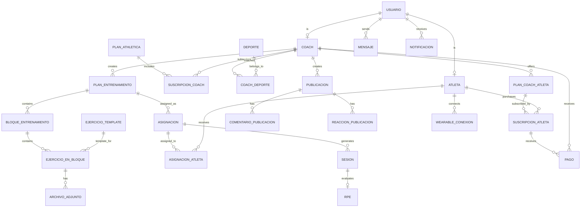

# Kleos MVP - Business ERD

```mermaid
erDiagram

    USUARIO ||--o| COACH : is
    USUARIO ||--o| ATLETA : is

    PLAN_ATHLETICA ||--o{ SUSCRIPCION_COACH : includes
    COACH ||--o{ SUSCRIPCION_COACH : subscribes

    COACH ||--o{ COACH_DEPORTE : coaches
    DEPORTE ||--o{ COACH_DEPORTE : belongs_to

    COACH ||--o{ PLAN_ENTRENAMIENTO : creates

    PLAN_ENTRENAMIENTO ||--o{ BLOQUE_ENTRENAMIENTO : contains

    BLOQUE_ENTRENAMIENTO ||--o{ EJERCICIO_EN_BLOQUE : contains

    EJERCICIO_TEMPLATE ||--o{ EJERCICIO_EN_BLOQUE : template_for

    EJERCICIO_EN_BLOQUE ||--o{ ARCHIVO_ADJUNTO : has

    PLAN_ENTRENAMIENTO ||--o{ ASIGNACION : assigned_as

    ASIGNACION ||--o{ ASIGNACION_ATLETA : assigned_to

    ATLETA ||--o{ ASIGNACION_ATLETA : receives

    ASIGNACION ||--o{ SESION : generates

    SESION ||--o| RPE : evaluates

    COACH ||--o{ PLAN_COACH_ATLETA : offers

    PLAN_COACH_ATLETA ||--o{ SUSCRIPCION_ATLETA : subscribed_by

    ATLETA ||--o{ SUSCRIPCION_ATLETA : purchases

    SUSCRIPCION_ATLETA ||--o{ PAGO : receives

    COACH ||--o{ PAGO : receives

    USUARIO ||--o{ MENSAJE : sends

    USUARIO ||--o{ NOTIFICACION : receives

    COACH ||--o{ PUBLICACION : creates

    PUBLICACION ||--o{ COMENTARIO_PUBLICACION : has

    PUBLICACION ||--o{ REACCION_PUBLICACION : has

    ATLETA ||--o{ WEARABLE_CONEXION : connects
```